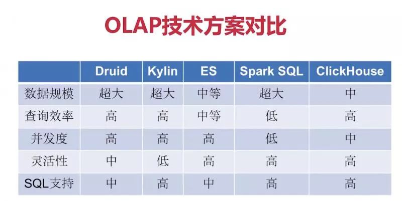
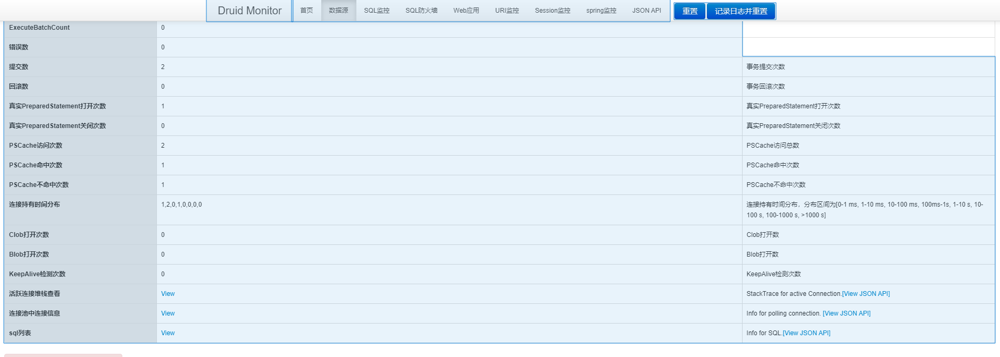

### 介绍
https://developer.aliyun.com/article/937323


### 官方网址:
https://druid.apache.org/docs/latest/configuration/index.html

https://github.com/alibaba/druid/wiki/%E5%B8%B8%E8%A7%81%E9%97%AE%E9%A2%98        

### 引入依赖
```
<dependency>
    <groupId>com.alibaba</groupId>
    <artifactId>druid-spring-boot-starter</artifactId>
    <version>1.1.10</version>
</dependency>

登录访问：https://127.0.0.1:8019/druid/login.html
```


### mybatis 网址
1. https://mybatis.net.cn/
2. https://mybatis.org/mybatis-3/
3. https://mybatis.org/mybatis-3/zh/configuration.html#

###开箱配置
```
spring:
  datasource:
    type: com.alibaba.druid.pool.DruidDataSource
    driverClassName: com.mysql.cj.jdbc.Driver
    url: jdbc:mysql://${url}:${port}/${数据库名}?useUnicode=true&characterEncoding=utf8&autoReconnect=true&useSSL=false&allowMultiQueries=true&useAffectedRows=true
    username: ${username}
    password: ${password}
  druid:
      initial-size: 10 # 初始化时建立物理连接的个数。初始化发生在显示调用init方法，或者第一次getConnection时
      min-idle: 10 # 最小连接池数量
      maxActive: 200 # 最大连接池数量
      maxWait: 60000 # 获取连接时最大等待时间，单位毫秒。配置了maxWait之后，缺省启用公平锁，并发效率会有所下降，如果需要可以通过配置
      timeBetweenEvictionRunsMillis: 60000 # 关闭空闲连接的检测时间间隔.Destroy线程会检测连接的间隔时间，如果连接空闲时间大于等于minEvictableIdleTimeMillis则关闭物理连接。
      minEvictableIdleTimeMillis: 300000 # 连接的最小生存时间.连接保持空闲而不被驱逐的最小时间
      validationQuery: SELECT 1 FROM DUAL # 验证数据库服务可用性的sql.用来检测连接是否有效的sql 因数据库方言而差, 例如 oracle 应该写成 SELECT 1 FROM DUAL
      testWhileIdle: true # 申请连接时检测空闲时间，根据空闲时间再检测连接是否有效.建议配置为true，不影响性能，并且保证安全性。申请连接的时候检测，如果空闲时间大于timeBetweenEvictionRun
      testOnBorrow: false # 申请连接时直接检测连接是否有效.申请连接时执行validationQuery检测连接是否有效，做了这个配置会降低性能。
      testOnReturn: false # 归还连接时检测连接是否有效.归还连接时执行validationQuery检测连接是否有效，做了这个配置会降低性能。
      poolPreparedStatements: true # 开启PSCache
      maxPoolPreparedStatementPerConnectionSize: 20 #设置PSCache值
      connectionErrorRetryAttempts: 3 # 连接出错后再尝试连接三次
      breakAfterAcquireFailure: true # 数据库服务宕机自动重连机制
      timeBetweenConnectErrorMillis: 300000 # 连接出错后重试时间间隔
      asyncInit: true # 异步初始化策略
      remove-abandoned: true # 是否自动回收超时连接
      remove-abandoned-timeout: 1800 # 超时时间(以秒数为单位)
      transaction-query-timeout: 6000 # 事务超时时间
      filters: stat,wall,log4j2
      connectionProperties: druid.stat.mergeSql\=true;druid.stat.slowSqlMillis\=5000
      web-stat-filter:
        enabled: true
        url-pattern: "/*"
        exclusions: "*.js,*.gif,*.jpg,*.bmp,*.png,*.css,*.ico,/druid/*"
      stat-view-servlet:
        url-pattern: "/druid/*"
        allow:
        deny:
        reset-enable: false
        login-username: admin
        login-password: admin

```
