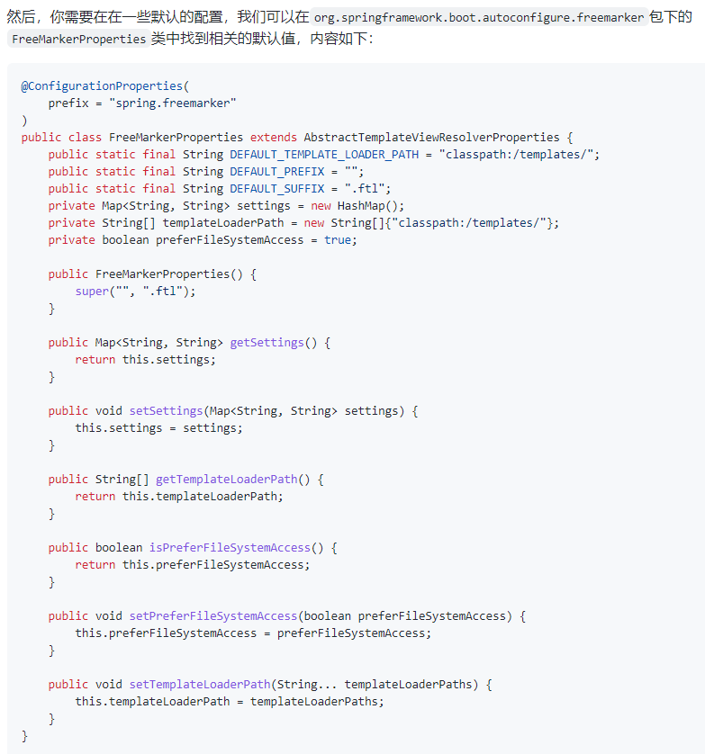

netstat -ano | findstr 8019
TCP    0.0.0.0:8019           0.0.0.0:0              LISTENING       4196
TCP    [::]:8019              [::]:0                 LISTENING       4196

taskkill /f /pid 4196


### springboot 2.0以上目前支持的数据源有以下三种
com.zaxxer.hikari.HikariDataSource (Spring Boot 2.0 以上,默认使用此数据源)

org.apache.tomcat.jdbc.pool.DataSource

org.apache.commons.dbcp2.BasicDataSource
                                                 

###
```
easyexcel官方地址:

https://easyexcel.opensource.alibaba.com/index.html

https://github.com/alibaba/easyexcel

```


### freemarker
1. https://geek-docs.com/spring-boot/spring-boot-tutorials/spring-boot-freemarker.html
2. 官网: https://freemarker.apache.org/
3. http://freemarker.foofun.cn/

